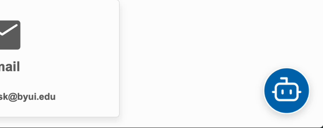

!!! note "How to Access"

    To access the BYUI Support Agent simply visit https://supportagent.byui.edu (*Login required*).

The "**BYUI Support Agent**" or simply "**Support Agent**" is an advanced **multi-agent generative AI system** developed by AI engineers at BYU-Idaho to help students and employees of **Brigham Young University-Idaho** quickly find answers to common support questions. When released in early December 2025, the application will be accessed via a chat widget on all byui.edu websites, in the bottom right corner of the page as seen below:

This initiative represents a significant evolution from BYU-Idaho's previous FAQ chatbot, which was built on the Genesys Dialog Engine Bot Flows. The new Support Agent offers a more adaptive, intelligent, and scalable approach to student engagement—improving accuracy and accessibility while reducing the workload on Support Center staff.

## Why We Built This

The BYU-Idaho Support Center is tasked with supporting a larger student population with fewer staff. However, resource constraints limit the ability of staff to provide the level of support that is needed for the rising demand. The Support Agent addresses this challenge by providing:

- **After-Hours Support**: AI-assisted help available 24/7 for general university questions
- **Reduced Staff Workload**: High-accuracy self-service reduces the load on first-level support agents
- **Faster Response Times**: Students get instant answers without waiting in queue
- **Personalized Support**: Context-aware responses tailored to each student's situation
- **Focus on Complex Issues**: Support Center staff can dedicate more time to complex student needs requiring human interaction

## How It Works

Powered by GPT-5.2 and retrieval augmented generation (RAG) technology, the Support Agent draws from a comprehensive knowledge base curated by the BYU-Idaho Support Center's staff to provide accurate, grounded responses based on official knowledge sources. The application is built using the [OpenAI Agents SDK](https://openai.github.io/openai-agents-python/){:target="\_blank"}, which enables the creation of completely agentic systems for tasks ranging from simple question answering to complex multi-agent orchestration.

### Multi-Agent Architecture

Unlike traditional chatbots that follow rigid decision trees, the Support Agent uses a **multi-agent orchestration framework** where specialized AI agents collaborate autonomously to deliver accurate, compliant, and contextually aware responses. This architecture includes:

- **Knowledge Retrieval Agent**: Searches the internal knowledge base for relevant information
- **Web Research Agent**: Finds current information from official university sources
- **Orchestrator Agent**: Coordinates between agents and determines the best path to answer your question
- **Escalation Agent**: Recognizes when human assistance is needed and routes you to the appropriate resource

This modular design means the system can easily be extended to support additional departments and integrate with more campus systems over time.

## What is an AI agent?

The same LLM technology that powers ChatGPT can also serve as the foundation for an “Agent.” Unlike a simple chatbot, an AI agent can _**reason about requests and take meaningful actions**_ with a **_degree of autonomy_**. This is possible because agents can be **_connected to campus systems and tools_**—such as knowledge bases, academic calendars, student records, or service portals—and then use those resources to complete tasks.

For example, an AI agent at BYU-Idaho could:

- Look up an upcoming registration deadline on the academic calendar for a student.
- Search academic policies and submit a ticket for a student with an unresolved concern.
- Assist IT by triaging support requests before routing them to staff.

These agents don't replace people—they extend the university's ability to serve. They operate under clear guardrails, working alongside faculty and staff to reduce repetitive workloads and provide students with faster, more consistent support.

The BYUI Support Agent takes this concept further by using **multiple agents working together**. Instead of a single agent trying to do everything, specialized agents handle specific tasks (like searching the knowledge base, researching current policies, or deciding when to escalate to a human). This multi-agent approach provides more accurate, reliable, and contextually appropriate responses.

## Primary Objectives

In order to successfully implement this initiative, the following primary objectives are essential:

- **Leverage AI**: Leverage the advantages of generative artificial intelligence such as cost, availability, consistency, and speed for common support tasks like question answering.
- **Build agent-centric**: Build a future-proof, agentic system that can extend to additional departments, integrate with existing systems, automate and complete tasks, and serve as a platform for other AI agents.
- **Align with BYU-Idaho Values**: Build an agent that is aligned with the values of BYU-Idaho, including the Honor Code, and is designed to help students and employees at BYU-Idaho.
- **Be Measurable**: Build an agent that is measurable and can be evaluated to ensure it is meeting the needs of students and employees at BYU-Idaho. In other words, we must be able to measure the success of the agent and make improvements based on the data.

## Evolution from Previous System

The Support Agent represents a fundamental shift from the university's previous approach to automated support:

| Feature              | Previous System (Genesys) | Support Agent                        |
| -------------------- | ------------------------- | ------------------------------------ |
| **Architecture**     | Intent-based NLU          | Generative AI (RAG + Agents)         |
| **Maintenance**      | Manual intent training    | Dynamic learning from knowledge base |
| **Flexibility**      | Rigid flow design         | Adaptive multi-agent orchestration   |
| **Scalability**      | Limited                   | Modular and department-expandable    |
| **Response Context** | Static                    | Context-aware with real-time lookups |

This shift from **intent-based AI** to **contextual generative AI** enables the system to support more nuanced, natural, and scalable conversations across all support domains.

## Future Expansion

The Support Agent is designed as a platform that can grow with the university's needs. Future phases may include:

- **Department-specific agents**: Specialized sub-agents for Financial Aid, Admissions, Student Records, and Advising
- **Enhanced integrations**: Direct connections to more campus systems for automated task completion
- **Expanded capabilities**: Proactive notifications, appointment scheduling, and personalized recommendations
- **Cross-department collaboration**: Multiple department agents working together to solve complex student needs

The modular architecture ensures that new capabilities can be added without disrupting existing functionality.

## What Makes It Special

The BYU-Idaho Support Agent is designed specifically for BYU-Idaho students and staff:

### BYU-Idaho Focused

- Trained exclusively on official BYU-Idaho policies and procedures
- Understands the unique culture and values of the university
- Provides answers that align with the values of BYU-Idaho

### Advanced AI Technology

- **OpenAI GPT-5.2**: Latest conversational AI technology for natural interactions from OpenAI
- **Smart Search**: Uses Pinecone vector search to instantly find relevant information from the internal knowledge base
- **Context Understanding**: Accurate understanding of content and context tailored to the needs of BYU-Idaho students and employees
- **Multi-Agent RAG System**: Multiple specialized agents work together to handle knowledge retrieval, web research, and escalation decisions

### Private & Secure

- **FERPA-compliant**: Protects student privacy and educational records with built-in compliance guardrails
- **Enterprise-grade Security**: Uses Microsoft Azure's enterprise-grade cloud security and reliability
- **Church Account Authentication**: Secure Single Sign-On (SSO) authentication for all users
- **Confidential**: All data is encrypted and stored in BYU-Idaho's private Azure tenant

### Integrated with Campus Systems

The Support Agent is connected to key campus systems to provide seamless support:

- **Genesys Cloud**: For live agent escalation when human assistance is needed
- **TeamDynamix**: For ticket creation and issue tracking
- **Pinecone**: Enterprise-grade vector database for fast, accurate knowledge retrieval
- **Microsoft**: Built on Microsoft's enterprise ecosystem for reliability, security, and scalability

### Always Available

- **24/7 Access**: Get help any time, day or night
- **Instant Responses**: No waiting - answers appear in seconds
- **No Limits**: Ask as many questions as you need

## Tips for Better Results

To get the most helpful responses from the Support Agent:

- **Be Specific**: Ask clear, detailed questions
- **Provide Context**: Mention your situation (e.g., "I'm having a hard time finding the link to Canvas...")
- **Ask Follow-ups**: Don't hesitate to ask for clarification or more details
- **Leave Feedback**: Click the star button on the response you receive to provide feedback (this helps us improve the agent)

## Getting Started

Ready to start using the BYU-Idaho Support Agent? Getting help is easy!

### How to Access the Support Agent

1. **Visit the website**: Go to [https://supportagent.byui.edu](https://supportagent.byui.edu){:target="\_blank"}
2. **Sign in**: Use your Church username and password to access the agent.
3. **Start Chatting**: Type your question and get instant AI-powered responses

## Governance and Support

The Support Agent is developed and maintained by BYU-Idaho Information Technology in collaboration with the Support Center:

- **Project Lead**: Ron Vallejo, AI Engineer
- **Governance**: IT Portfolio and Project Management Council, and AI Governance Council
- **Stakeholder Partners**: BYU-Idaho Support Center and Student Services

The project follows university governance standards for AI applications and is maintained internally with minimal IT overhead. Continuous improvements are made based on user feedback and performance metrics.

## Need Additional Help?

While the Support Agent can answer many questions, some situations may require human assistance. The agent is designed to recognize when human support is needed and will guide you to the appropriate resource. You can also directly contact:

**BYU-Idaho Support Center**

- **Phone**: 208-496-1411 (Call, SMS, WhatsApp)
- **Email**: [ask@byui.edu](mailto:ask@byui.edu)
- **Website**: [www.byui.edu/contact-us/](https://www.byui.edu/contact-us/){:target="\_blank"}

The Support Center staff are available to assist with complex issues, sensitive matters, or any situation where you prefer to speak with a person.
