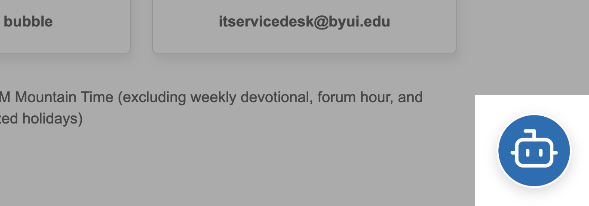

We've created a chat widget that provides students, faculty, and staff quick access to the BYU-Idaho Support Agent. This guide describes how to use and customize the chat widget.

## How We Embedded the Chat Widget

Our web engineers simply added a single line of code before the closing `</body>` tag on our global site, which then propogates the widget to all child pages

Example code:

``

## Security

The chat widget is privately hosted on Azure Front Door and is only accessible on BYU-Idaho web domains (e.g. `*.byui.edu`). All other domains are blocked and will not render the widget.

## Features

- **Lightweight**: ~3KB minified, no dependencies
- **Easy Integration**: One-line embed code
- **Responsive**: Smooth hover animations
- **Non-intrusive**: Fixed position, high z-index
- **Accessible**: Opens in new tab with proper attributes
- **CDN-hosted**: Fast global delivery via Azure Front Door

## What It Looks Like

The chat widget displays a circular chat bubble with the BYU-Idaho Support Agent icon. When users hover over it, it scales up slightly. Clicking opens the support agent in a new browser tab.
