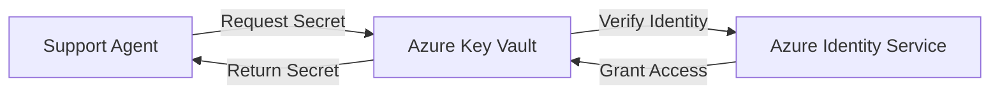

# Infrastructure & Security

!!! note "For Internal Stakeholders"

    This document provides an overview of the Support Agent's technical infrastructure, security measures, and AI capabilities. It's designed to help stakeholders understand how the system works without requiring deep technical expertise.

<div style="height: 20px;"></div>

## Cloud Infrastructure

The Support Agent runs on **Microsoft Azure**, BYU-Idaho's trusted cloud platform. The application is hosted using Azure Container Apps, which provides automatic scaling, high availability, and enterprise-grade security.

### How Scaling Works

The Support Agent automatically adjusts to demand:

- **Low traffic** (nights, weekends): Runs minimal instances
- **Medium traffic** (normal business hours): Scales to more instances
- **High traffic** (start of semester, registration): Can scale up to match demand
- **Response time**: Less than 2 seconds for most queries

This ensures students get fast responses during peak times while keeping costs reasonable during quiet periods.

<div style="height: 20px;"></div>

## Security & Secrets Management

Security is a top priority for the Support Agent. We use **Azure Key Vault** to protect sensitive information.

### Azure Key Vault

Azure Key Vault is a secure storage system for secrets, API keys, and credentials. Instead of storing sensitive data in the application code, we store it in a secure vault that only authorized systems can access.

**Security benefits:**

- **Centralized Security**: All secrets in one secure location
- **Access Control**: Only the Support Agent application can retrieve secrets
- **Audit Trail**: We can track when secrets are accessed
- **Automatic Rotation**: Secrets can be updated without redeploying the application
- **No Code Exposure**: Secrets never appear in source code or version control

### How It Works



1. **Support Agent needs a secret** (e.g., to call OpenAI)
2. **Azure verifies identity** using Managed Identity (passwordless authentication)
3. **Key Vault grants access** if authorized
4. **Secret is used** for the API call
5. **Secret is discarded** from memory after use

This happens automatically without requiring manual password entry or configuration files.

<div style="height: 20px;"></div>

## AI Architecture

The Support Agent uses the **OpenAI Agents SDK**, an official framework from OpenAI designed for building production AI systems. This is the same technology used by enterprise customers worldwide.

### OpenAI Agents SDK

The Agents SDK provides a structured way to build AI assistants that can:

- **Think and Reason**: Use GPT-5.1 for intelligent responses
- **Search Knowledge**: Query our knowledge base of BYU-Idaho information
- **Search the Web**: Find current information when needed
- **Remember Conversations**: Maintain context across multiple messages
- **Stay on Topic**: Use guardrails to ensure appropriate responses

### Agent Patterns

The system uses several proven AI patterns:

#### 1. Retrieval-Augmented Generation (RAG)

Instead of relying solely on the AI's training data, the Support Agent **searches our knowledge base** before answering. This ensures responses are:

- ✅ Based on official BYU-Idaho information
- ✅ Current and accurate
- ✅ Aligned with university values and policies

#### 2. Session Memory

Each conversation is stored in a **PostgreSQL database** using the OpenAI Agents SDK's session management. This allows the AI to:

- Remember what was discussed earlier in the conversation
- Provide context-aware follow-up responses
- Maintain conversation flow across multiple messages
- Track conversation history for quality assurance

#### 3. Agentic Orchestration

The Support Agent uses a "main agent" that can delegate to specialized sub-agents:

```
Main Agent (Coordinator)
├── Knowledge Search Agent (BYU-Idaho information)
├── Web Search Agent (Current events, external information)
└── Direct Response Agent (General questions)
```

This architecture allows the system to:

- Choose the right information source for each question
- Combine multiple sources when needed
- Provide cited, verifiable answers

#### 4. Conversation Guardrails

The system includes safety measures to ensure appropriate interactions:

- **Topic Boundaries**: Keeps conversations focused on BYU-Idaho support
- **Content Filtering**: Blocks inappropriate requests
- **Value Alignment**: Ensures responses align with university values
- **Quality Monitoring**: Tracks conversation quality for continuous improvement

<div style="height: 20px;"></div>

## Authentication & Access Control

The Support Agent uses **Azure Easy Auth** for user authentication, which integrates with BYU-Idaho's identity providers.

### Supported Authentication

| Provider           | Purpose                                          | Users                  |
| ------------------ | ------------------------------------------------ | ---------------------- |
| **BYU-Idaho Okta** | Primary authentication with Church Login and SSO | Students and employees |

### How Authentication Works

1. **Student visits** the Support Agent website
2. **Azure Easy Auth intercepts** the request
3. **Student chooses login method** (Okta or Church Login)
4. **Student authenticates** with their credentials
5. **Azure verifies identity** and creates a session
6. **Student accesses** the Support Agent with personalized experience

**Benefits of authentication:**

- **Personalization**: AI knows the student's name, program, and context
- **Analytics**: Track usage patterns while respecting privacy
- **Security**: Prevent abuse and ensure appropriate access
- **Compliance**: Meet FERPA requirements for student data protection

### Passwordless Security

The system uses **Azure Managed Identity** for internal authentication:

- No passwords to manage or rotate
- Automatic credential management
- Reduced security risk
- Simplified deployment and maintenance

This means the application can securely access Azure services (Key Vault, databases, etc.) without storing any passwords or API keys in the application.

<div style="height: 20px;"></div>

## Monitoring & Reliability

The Support Agent includes comprehensive monitoring to ensure reliable service:

### Alert System

Automated alerts notify IT staff via SMS when issues occur:

- **Critical Alerts**: Application downtime, service outages
- **Warning Alerts**: High CPU usage, memory pressure, scaling limits

**Alert recipients:** IT support team (configurable)

### Health Monitoring

The system tracks key metrics:

- **Response Time**: Average time to generate a response
- **Error Rate**: Percentage of failed requests
- **Active Users**: Number of concurrent conversations
- **Resource Usage**: CPU, memory, and database performance
- **AI Performance**: Quality of responses, citation accuracy

### Uptime & Availability

**Target SLA:** 99.9% uptime (less than 9 hours downtime per year)

The system includes:

- \*\*Automatic health checks every 60 seconds
- \*\*Auto-restart on failure
- \*\*Graceful degradation (continues working with reduced features if dependencies fail)

<div style="height: 20px;"></div>

## Data Privacy & Compliance

### Data Storage

Student conversations are stored securely:

- **Database**: Azure PostgreSQL (encrypted at rest and in transit)
- **Retention**: Conversation history for quality assurance and analytics
- **Access Control**: Only authorized IT staff can access raw conversation data

### Privacy Protections

- **FERPA Compliance**: Student data is protected according to federal regulations
- **No Third-Party Sharing**: Conversations never leave Azure or OpenAI's secure environment
- **Encryption**: All data encrypted in transit (TLS 1.3) and at rest (AES-256)

<div style="height: 20px;"></div>

## Future Enhancements

### Planned Improvements

- **Voice Agent**: Phone-based AI support for accessibility
- **Advanced Analytics**: Detailed usage insights and conversation trends
- **Multi-Language Support**: Spanish and other languages for international students
- **Multi-Agent Collaboration**: Specialized agents for advising, financial aid, registration

### Scalability Roadmap

As the Support Agent grows:

- Increase maximum instances from 10 to 50+
- Add geographic redundancy (deploy to multiple Azure regions)
- Implement advanced caching for faster responses
- Add load balancing for global access
- Enhance monitoring and observability

<div style="height: 20px;"></div>

## References

[^1]: [Azure Container Apps Documentation](https://learn.microsoft.com/en-us/azure/container-apps/){:target="\_blank"}
[^2]: [Azure Key Vault Documentation](https://learn.microsoft.com/en-us/azure/key-vault/){:target="\_blank"}
[^3]: [OpenAI Agents SDK Documentation](https://openai.github.io/openai-agents-python/){:target="\_blank"}
[^4]: [Azure Easy Auth Documentation](https://learn.microsoft.com/en-us/azure/app-service/overview-authentication-authorization){:target="\_blank"}
[^5]: [FERPA Compliance Guidelines](https://www2.ed.gov/policy/gen/guid/fpco/ferpa/index.html){:target="\_blank"}

---

_This document is maintained by the BYU-Idaho AI Engineering Team. Last updated: November 20, 2025._
