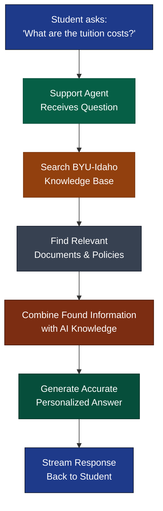

The BYUI Support Agent is an AI agent developed in-house to help students quickly find answers to common support questions. Powered by GPT-5.1 from OpenAI and retrieval augmented generation (RAG) technology, the Support Agent draws from a comprehensive knowledge base to provide accurate, grounded responses based on official BYU-Idaho knowledge sources.

Developed by Brigham Young University-Idaho (BYU-Idaho) and hosted in the Microsoft Azure cloud. The AI system is built with the OpenAI Agents SDK, which allows for the creation of completely agentic systems for tasks ranging from simple question answering to complex multi-agent orchestration systems.

The user interface is built using React and TypeScript and styled for the BYU-Idaho brand. React allows developers to build modern, responsive Generative AI applications, like the BYUI Support Agent. Developed by Facebook, React is a powerful tool for building complex user interfaces that are easy to maintain and scale.

## Model Information

The Support Agent is powered by [OpenAI GPT-5.1](https://openai.com/index/gpt-5-1/){:target="\_blank"}. GPT 5.1 has an impressive context window of 400,000 tokens. Since the AI model has a knowledge cutoff of 2025-10-30 and has been trained on only public data, it is unable to accurately answer questions about current events or topics that not included in it's original training data. As is, GPT 5.1 is a great tool for answering general questions about BYU-Idaho. But, only if the question is within it's knowledge cutoff date or if the information was publicly available at the time of training.

## Knowledge Information

The Support Agent's employs a retrieval augmented generation (RAG) approach to answer questions. Engineers "augment" GPT 5.1 knowledge by allowing it to search our private knowledge base for relevant information. Under the hood, each time a user asks a question, the Support Agent's will search the private knowledge base for relevant information, then use that information to answer the user's question. This technique minimizes "hallucination" and grounds the AI's responses in trustworthy information.

## RAG Architecture

In 2020, Facebook (now Meta) invented a technique called [Retrieval Augmented Generation (RAG)](https://arxiv.org/abs/2005.11401){:target="\_blank"} to improve the accuracy of AI models for domain-specific tasks like question answering for support agents. RAG works by augmenting the AI model's knowledge with external sources of information, such as a knowledge base or a database. This allows the AI model to answer questions with more accuracy and precision. Engineers at BYU-Idaho have employed this technique to enable the Support Agent to answer questions about BYU-Idaho. The image below illustrates how RAG works for the Support Agent.

